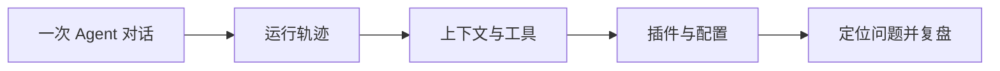

# DSH Observatory

## DeepSeek Harness 的 Agent 可观测工作台

**让 Agent 执行过程可见、可诊断、可复盘。**

当 Agent 的回答变慢、工具调用失败，或者一次 Prompt 调整带来意外结果时，单看最终回复往往找不到原因。DSH Observatory 把一次运行拆成可以理解的现场：模型经历了什么、看到了什么、调用了什么，以及每一步花了多少时间。

它围绕 DeepSeek Harness 构建，作为一个轻量插件接入现有工作流，不改变 Agent 的决策方式，只把运行信息整理成清晰的观察界面。

## 一眼看懂 Agent 在做什么

### 执行轨迹

按每次对话分块查看 Agent 的运行过程。展开一个 Turn，即可看到模型请求、工具调用、返回结果和耗时细节。

### 上下文账本

按占用从高到低展示上下文来源：Prompt、Skill、工具 Schema 和运行时信息分别贡献了多少内容，模型实际能看到什么一目了然。

### 工具表现

集中查看工具调用次数、失败次数、平均耗时和取消原因，快速定位“慢在哪里”和“错在哪里”。

### 能力地图

查看当前 Profile、Bundle、插件和服务的加载关系。插件、服务和挂载位置默认收起，需要时再展开技术来源，避免信息堆在一起。

### 配置中心

直接管理本地 `.dsh` 中的 Skill、MCP 服务和 Sub-agent 配置：查看内容、修改文件、保存到本机，并保留敏感信息脱敏和文件版本保护。

### 现场复盘

导出脱敏后的 Session 记录，用于提交问题、比较两次运行，或保存一次重要实验的完整现场。

## 从现象到结论



DSH Observatory 关注的是 Agent 的“过程证据”：

- 最终回复不理想，先看模型收到了哪些上下文
- 工具表现异常，沿时间线查看调用和返回
- 插件没有生效，检查加载关系、服务和配置来源
- Prompt 或 Skill 改动后，用两次运行的现场进行比较

## 适合谁

- 正在使用 DeepSeek Harness 构建 Agent 的开发者
- 需要调试工具、Prompt、Skill 或 MCP 的团队
- 想把一次 Agent 运行保存下来、复现并解释清楚的人

## 快速体验

需要 Node.js `>=22.19.0` 和 pnpm `>=11`。

```bash
pnpm install
pnpm dev
```

打开 `http://127.0.0.1:4173`，即可查看无需 API Key 的演示会话。

## 接入 DeepSeek Harness

先构建本地插件：

```bash
pnpm build:plugin
```

再将它加入 Harness 的 Web Profile：

```bash
dsh plugin --profile web add /absolute/path/to/dsh-observatory
dsh web
```

启动后，从侧边栏进入 **Observatory**。它会在现有 Harness 会话中持续收集和展示运行信息。

## 本地配置管理

配置中心读取用户级 `.dsh` 目录中的内容：

- `skills`：可复用的工作方法和指令
- `mcp`：外部工具服务配置
- `Sub-agent`：子 Agent 的预设与行为配置

修改配置前会保留文件版本校验；MCP 中的 API Key、Token 和 Secret 在界面与导出内容中会自动隐藏。

## 项目状态

当前版本面向 DeepSeek Harness `0.1.0-rc.6`，处于 Developer Preview。核心观测、配置管理和脱敏导出能力已经可用，后续将继续完善 Session 回放、双运行 Diff，以及 Prompt Section、Skill 和工具 Schema 的逐项来源追踪。

## License

MIT License
