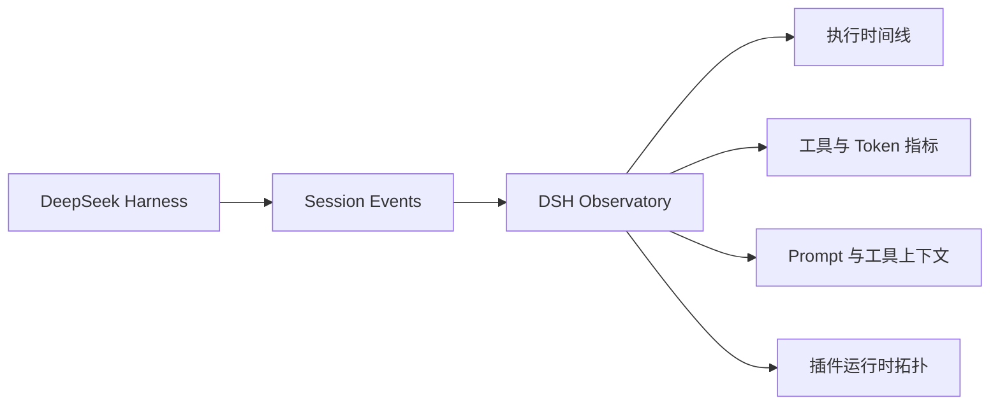

# DSH Observatory

## DeepSeek Harness 的运行时观测与调试工作台

让 Agent 执行过程可见、可诊断、可复盘。

DeepSeek Harness 把模型、工具、Prompt 和插件组合成一个完整的 Agent 运行时。问题也因此变得更难定位：它为什么变慢？哪一个工具失败了？模型实际看到了哪些上下文？一次改动到底带来了什么影响？

DSH Observatory 把这些答案放回同一个工作台，让你从运行结果回到执行现场。

## 它能解决什么

### 看见每一步

把一次 Agent 运行展开为清晰的时间线：Turn、Step、模型请求、工具调用和返回结果都能按顺序查看。

### 找到真正的问题

集中展示工具调用次数、失败次数、耗时和模型 Token，让“感觉变慢了”变成可以定位的事实。

### 理解模型看到了什么

展示 System Prompt、工具 Schema 和上下文来源，帮助你判断 Prompt 变长、工具变多或上下文变化是否影响了结果。

### 看清 Harness 的组成

用运行时拓扑展示当前 Profile、Bundle、插件和服务，让插件加载异常、依赖缺失和配置变化更容易被发现。

### 保留可复盘的现场

事件详情支持脱敏查看和 JSON 导出。Token、API Key、Bearer 凭据以及用户路径会在导出前自动处理。

## 工作方式



它不改变 Agent 的执行方式，也不替模型做决定，只负责把运行现场整理成可以理解、比较和导出的信息。

## 现在可以看到什么

- 概览：运行状态、Turn 数、工具调用、Token 和最近活动
- 执行轨迹：事件时间线、关键词搜索和 Turn / 模型 / 工具分类筛选
- 上下文：Prompt、工具 Schema 的来源及 Token 占用
- 插件拓扑：Profile、Bundle、插件和服务的加载关系
- 事件详情：时间、耗时、Turn、Step 和脱敏 Payload
- 会话导出：用于排查问题、提交反馈或保存实验现场

## 快速体验

环境要求：Node.js `>=22.19.0`、pnpm `>=11`。

```bash
pnpm install
pnpm dev
```

打开 `http://127.0.0.1:4173`，即可查看一个不需要 API Key 的演示会话。

## 接入 DeepSeek Harness

构建插件：

```bash
pnpm build:plugin
```

将本地插件加入 Harness 的 Web Profile：

```bash
dsh plugin --profile web add /absolute/path/to/dsh-observatory
dsh web
```

安装后，侧边栏底部会出现 Observatory 入口。复杂信息会在全屏工作台中展开，适合持续观察和重复调试。

## 适合这些场景

- 调试工具调用失败、超时和取消
- 对比 Prompt 或工具 Schema 变化前后的运行结果
- 检查插件是否正确加载、依赖是否就绪
- 为团队反馈保留一份脱敏的 Agent 运行现场
- 在开发阶段观察 Token 和上下文增长

## 项目状态

当前版本面向 DeepSeek Harness `0.1.0-rc.6`，处于 Developer Preview。它已经可以作为独立 Demo 使用，也可以作为 Harness 插件接入本地 Web Profile。

后续会继续完善：

- Host 与 Client 之间的只读诊断通道
- Session 回放与双运行 Diff
- Prompt Section、Skill 和工具 Schema 的逐项来源追踪
- 插件加载失败与依赖等待诊断

## 开发与验证

```bash
pnpm check
pnpm exec playwright test
```

MIT License
